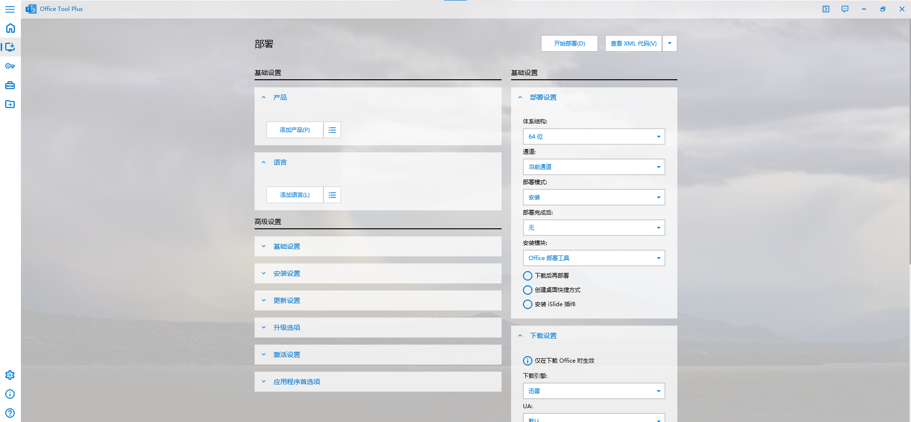
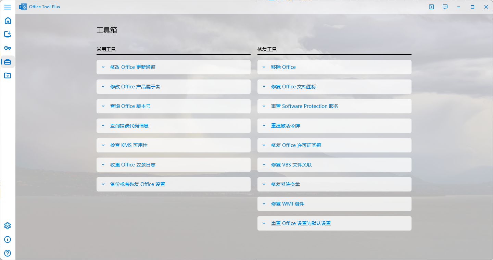
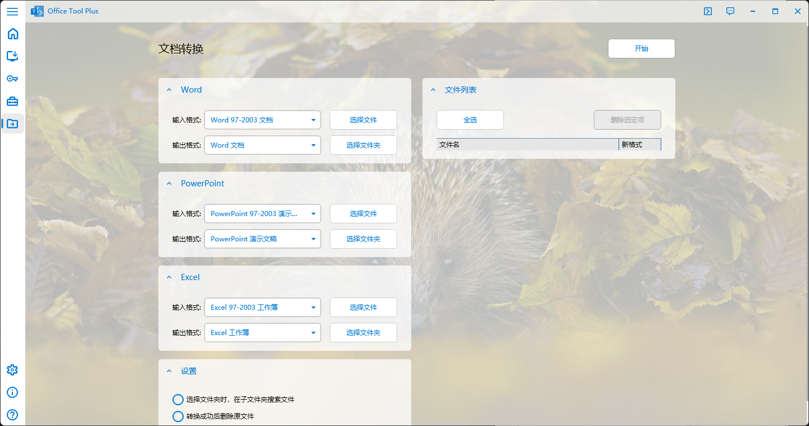
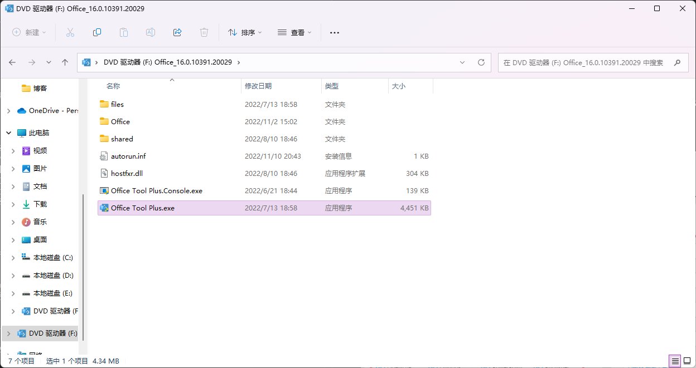
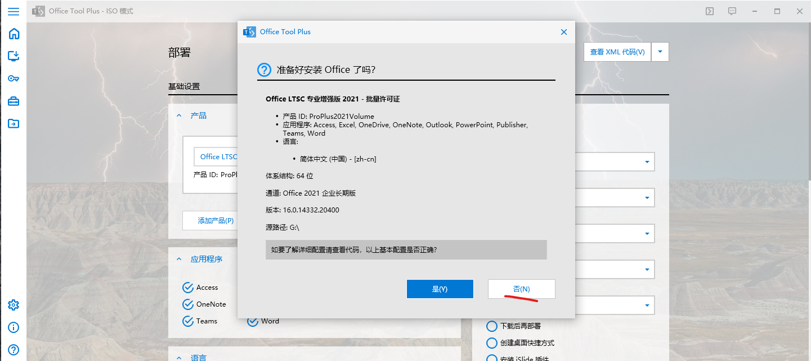
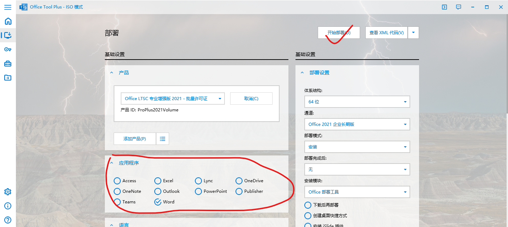
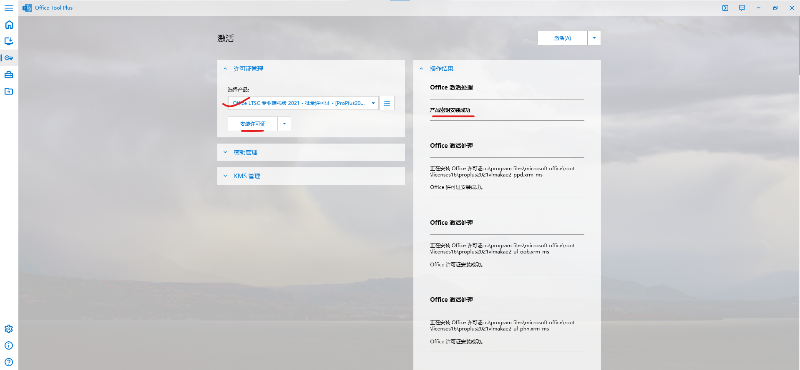
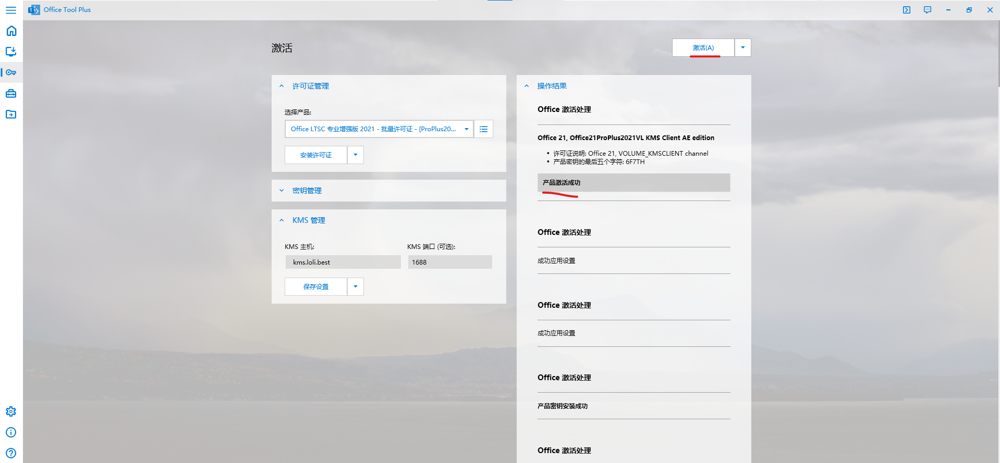
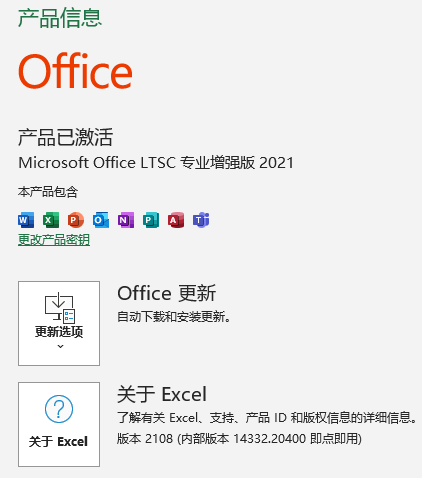

# Office Tool Plus 使用教程

### 目录

- 导言
- Office Tool Plus 基本界面介绍
- 配置并安装 Office
- 许可证安装与产品激活
- 附录

***

### **导言** 

什么是 Office Tool Plus？

Office Tool Plus 是一款专业的 Office 官方镜像下载器，它不仅可以在线下载和安装 Office 产品，还集成了各种实用性工具帮助用户部署和管理 Office。

***

## 一、Office Tool Plus 基本界面介绍

简单对Office Tool Plus各个界面做一下介绍 ~~基本上是废话~~

### 1.主界面

打开Office Tool Plus，首先是主界面

主要功能：

（1）新手教程 

（2）网页版 Microsoft Office

>暂时用不到

***

### 2.部署界面

点击左侧的第二个图标，打开部署界面

功能：

（1）查看当前电脑安装的 Office 产品

（2）通过多种方式安装 Office 产品，有多个版本可供安装

***

### 3.激活界面

点击左侧的第三个图标，打开激活界面

这些功能稍后会细讲

功能：

（1）产品许可证管理

（2）安装密钥

（3）KMS注册

（4）激活产品

***

### 4.工具箱界面

点击左侧的第四个图标，打开工具箱界面

功能强大

>务必谨慎使用！！！

***

### 5.文档转换界面

点击左侧的第五个图标，打开文档转换界面

功能强大

***

## 二、配置并安装 Office
**重点！**
### 1.移除原有的 Office

有的电脑在购买时会预装 Microsoft 365，但多数是试用版，而且产品功能受限。若想安装其余版本的产品，可能会彼此冲突，所以需要移除原有的 Office 产品。

>不管先前有没有安装，先进行移除，方便后续安装和激活

### **操作：** 

- 如下图，在工具箱界面中依次点击“移除 Office” “开始”

- 等待，直至下方状态栏出现“移除 Office 结束”

- 操作完成后，回到部署界面查看，若如下图所示，则已成功卸载 Ofiice 的所有产品

***

### 2.下载并安装 Office 产品

下面以安装“ Office LTSC 专业增强版 2021 - 批量许可证”为例

原因：  
专业增强版包含多种产品；2021的产品集成有最新的功能；批量许可证方便激活

### **操作：**
- 在 “产品”一栏中选择想要安装的office产品（带有“**-批量许可证**”，否则后续激活将无法进行）
  
- 在 “应用程序”一栏中选取想要安装的软件（按机主意见，默认三件套，公管经管可能需要 Access ）
  
- 在 “语言”一栏中选取 “简体中文（中国）”
  
- 在 “部署设置”一栏中选择对应的体系结构（普遍64位）；选择与产品版本相对应的通道（优选“当前通道”，如果不行则使用“年份+企业长期版）；“部署模式”选择“**安装**”；勾选下方的“下载后再部署”
  
- 在下载设置中勾选“下载后校验 Office 安装文件”
  
- 点击右上方“开始部署”

程序会自动下载对应的 Office 产品并安装，下载过程耗时较久

>下载、安装过程中会出现进度条不动的情况，请耐心等待

如图所示，安装成功

### 拓展：Office 部分应用程序及其功能

| Office 应用     | 功能        |
| :-----------:  | :---------: |
| 三件套          | 不赘述      |
| Access         | 数据管理    |
| OneNote        | 笔记        |
| OneDrive       | 云盘        |

*** 

### 3.通过ISO镜像文件安装 Office

Office Tool Plus 可以将下载好的文件“打包”成一个ISO文件，在电脑上装载ISO文件即可安装 Office，不用再次下载。

### **操作：**

- 在 “产品”一栏中选择想要安装的office产品（带有“**-批量许可证**”，否则后续激活将无法进行）
  
- 在 “应用程序”一栏中勾选**所有软件**（宁多勿少）
  
- 在 “语言”一栏中选取 “简体中文（中国）”
  
- 在 “部署设置”一栏中选择对应的体系结构（普遍64位）；选择与产品版本相对应的通道（优选“当前通道”，如果不行则使用“年份+企业长期版）；“部署模式”选择“**下载**”
  
- 在下载设置中勾选“下载后校验 Office 安装文件”
  
- 点击右上方“开始部署”

- 等待下载完毕
  
- 下载完毕后，“部署模式”选择“创建ISO文件”
  
- 点击右上方“开始部署”

- 选择创建ISO文件生成的位置

>生成的ISO文件可便携移动（放入U盘），不用再花时间下载

- 移除目标电脑原有的 Office
  
- 将U盘插入要安装 Office 的电脑
  
- 找到ISO文件，右键装载（或者在打开方式中选择“Windows 资源管理器”）
  
- 运行

- **等待，在弹出的安装窗口中点击“否”**

- 在“应用程序”一栏中选择欲安装的应用
  
- 开始部署

- 结束后记得卸载（即弹出ISO文件）

***

> **至此，Office 的安装已完成**

***

## 三、许可证安装与产品激活

**重重点！**

正版用户一般情况下不需要使用 Office Tool Plus 进行激活，登录账号/输入密钥即可激活 Office。但是都报任务了，机主要我们做什么，我想各位都很清楚。

激活开始前的注意事项：
> KMS 只能激活批量许可证  
> 激活后，在 KMS 主机以及网络正常的情况下，系统会自动续期（变相的永久）  
> 激活操作在联网情况下进行

对于KMS激活、正版与非正版的关系，不再赘述。可以参考 **[OTP作者的文章](https://www.coolhub.top/archives/42)** 。

### **操作：**

- 转到“激活”界面
  
- 清除激活状态
  

- 在 “许可证”中一栏选择对应版本的office（带有批量许可证）
  
- 安装许可证，待右侧状态栏出现“产品密钥安装成功”提示后，再进行下一步
  

- 在“KMS 管理”一栏填写相关信息  
  KMS 主机：(以下地址任选，一个不行就换另一个)  
  kms.loli.best  
  kms.loli.beer  
  kms.ghpym.com   
  KMS 端口：1688

- 保存设置，待右侧状态栏出现“成功应用设置”后，点击右上角的“激活”
  

- 激活成功后会出现“产品激活成功”提示
  

- 点击 Windows 徽标，打开任意一个安装的 Office 产品

- 等待，在“接受许可协议”界面点击“接受/是”
  
- 后续弹窗按照机主意愿进行选择（默认接受）

- 点击产品左下角“账户”，可以看到产品的激活信息

**可以登录微软账户正常使用**

> **至此，Office 的激活已完成**

***

## 四、附录

**[1、OTP作者的文章](https://www.coolhub.top/archives/13)**

想要了解更多OTP的操作，或者对此博客有疑虑，可以查看OTP作者写的文章。

**2、提示**

与使用其他程序类似，在OTP的使用过程中，可能会出现卡顿（下载安装除外）、操作失败，或者人为操作不当等状况。  

这时候，请退出程序（若不能直接关闭，可在“任务管理器”中结束进程），再次打开，重新执行上一步操作

***

### 如有错误，请多多指正。   