# Windows系统的封装测试

## **目录**  
- [ 导言 ](#导言)	

- [ 准备工作 ](#准备工作)

- [ 使用NTLite预定制母盘 ](#一使用ntlite预定制母盘)

- [ 通过VMware定制系统 ](#二通过vmware定制系统)

- [ 封装系统](#三封装系统)

- [ 测试](#四测试)

***

## **导言** 

在执行任务的过程中，我们常常会遇到重装系统（或者在一块全新硬盘上安装windows系统）的任务。

在安装完系统后，还需要对系统进行一些设置，安装一些软件，才能获得极佳的体验。

那么，有没有一种方法，可以“制作”一个安装后无需设置，并且已安装必要软件的系统，从而达到节约操作时间的目的呢？

这就不得不提到“封装系统”了。

 **如果说，安装系统是将镜像文件释放出来，那么，封装系统就是将特定的系统压缩成镜像文件。**

 **如何将一个已经完成基础设置、安装了必要的社交和办公软件的Windows系统封装起来，并对封装之后的镜像进行测试，是这篇博客将讨论的问题。**
 
***

## **准备工作** 

### 1.软件安装：

- NTLite（镜像定制软件）：https://www.ntlite.com/download/

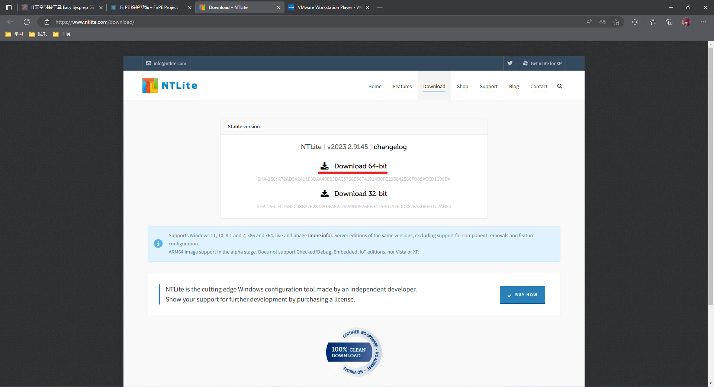

- VMware（虚拟机）：https://customerconnect.vmware.com/en/downloads/info/slug/desktop_end_user_computing/vmware_workstation_player/17_0

> 以上软件使用免费版本即可，无需注册或激活

***

### 2.文件准备：

- Windows原版镜像（MSDN i tell you）：https://next.itellyou.cn/

- Windows原版镜像（MSDN - 山己几子木）：https://msdn.sjjzm.com/ （以上二选一）

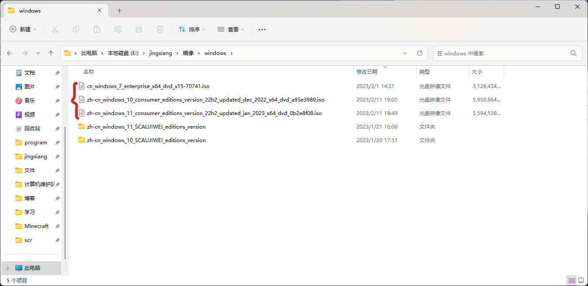

- Easy Sysprep（封装软件）：https://www.puresys.net/1222.html

- CCleaner（垃圾清理软件）：https://www.ccleaner.com/zh-cn/download

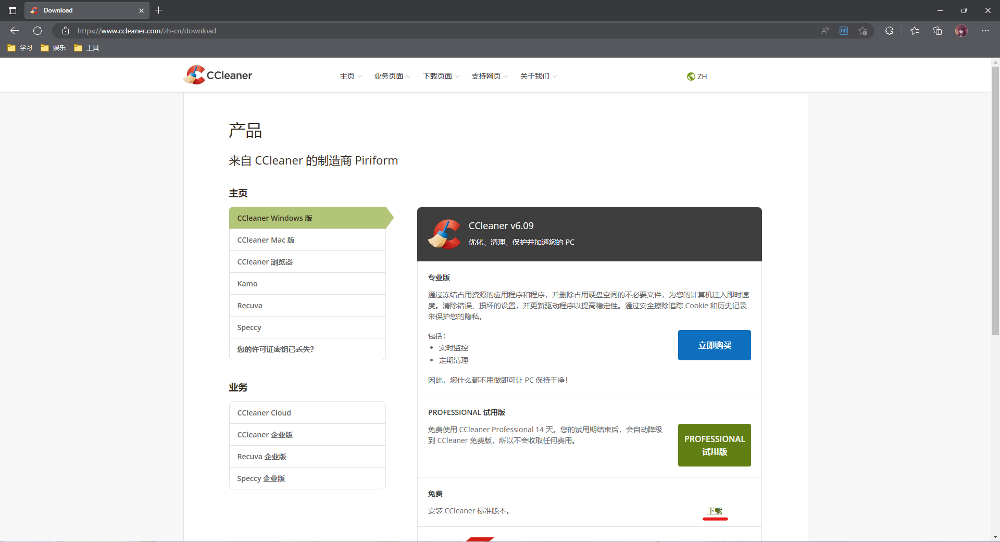

- Geek（程序卸载软件）：https://geekuninstaller.com/download

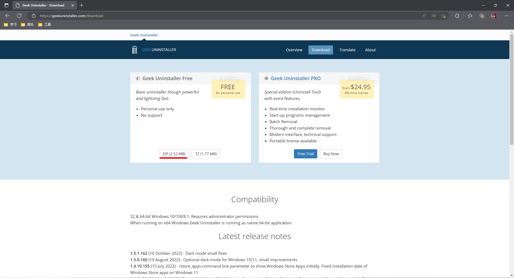

- FirPE（PE）：https://firpe.cn/page-247

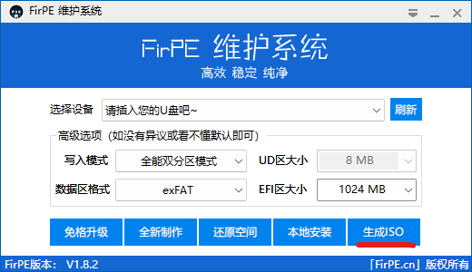

*** 

## **一、使用NTLite预定制母盘**

由于一些设置无法在系统中进行，这时候就需要用到NTLite对母盘进行预定制。

### 1.挂载镜像

- 解压下载好的原版系统镜像（以zh-cn_windows_11_consumer_editions_version_22h2_updated_jan_2023_x64_dvd_0b2e8f08为例）

- 找到位于**根目录\sources**的install.wim文件

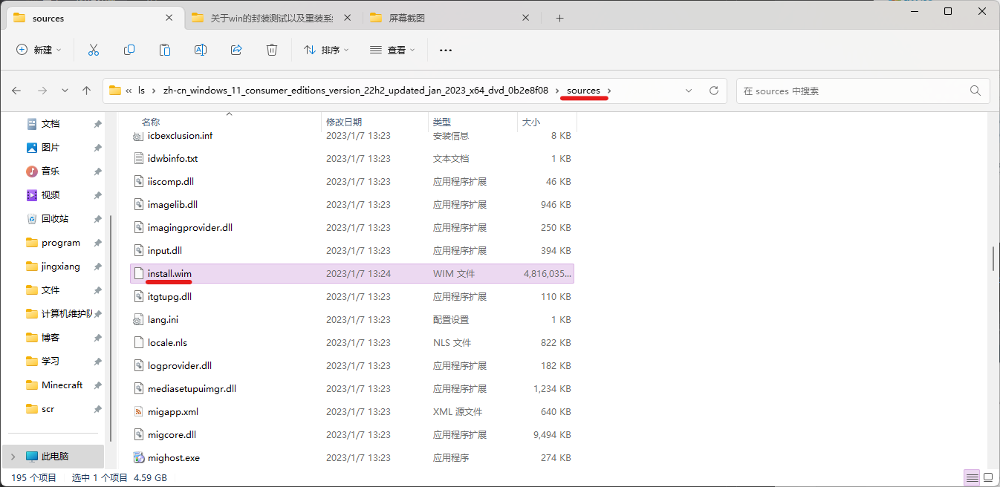

- 将其转移到**全英路径**的文件夹中

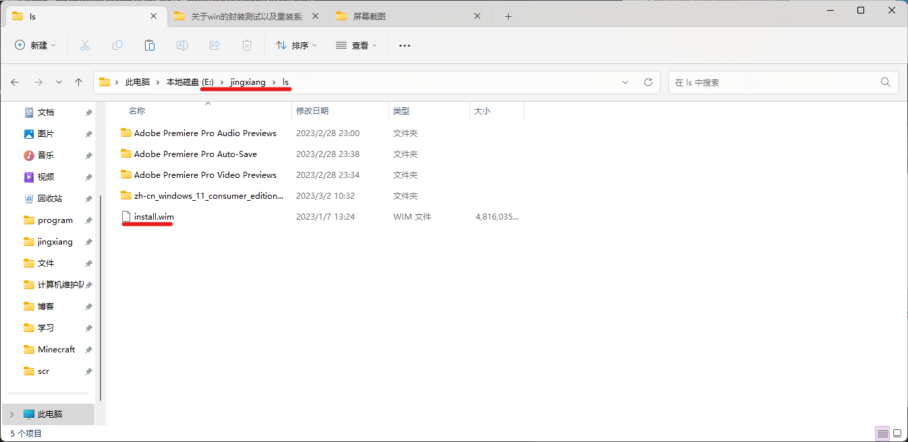

- 使用NTLite挂载（**先退出杀毒软件，否则会影响效率！！！**）

- 选择刚刚转移出来的install.wim文件

- 双击要挂载的版本（以专业版为例），待其加载完毕

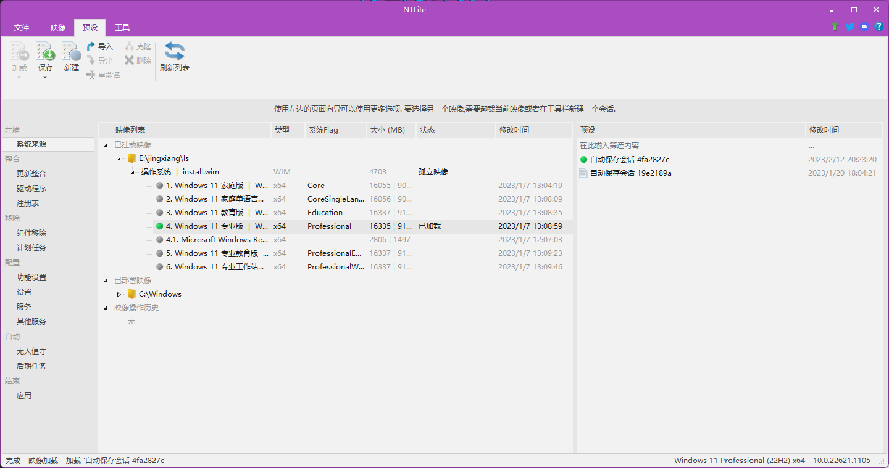

***

### 2.定制母盘

侧边栏的各项内容是可以对母盘进行的操作

**需要操作的只有“更新整合”“驱动程序”“无人值守”以及“应用”，其余最好不要修改**

**更新整合**——在这里可以下载并安装系统补丁或者运行库

- 打开后会自动选择最优的补丁（运行库）搭配

> 经测试，由于Windows系统具有“传递优化”功能，所以在软件中的下载速度不如安装后系统更新的速度，建议勾选体量小的更新（或者跳过这一步）

- 点击“加入队列”，就可以在队列中看到添加的更新

***

**驱动程序**——可以将本地驱动安装到母盘中（获取驱动的方法我会单独出一篇博客）

- 添加驱动，如NVIDIA显示适配器驱动、通用串行总线控制器、通用串行总线设备（原版Windows7系统没有集成USB驱动）

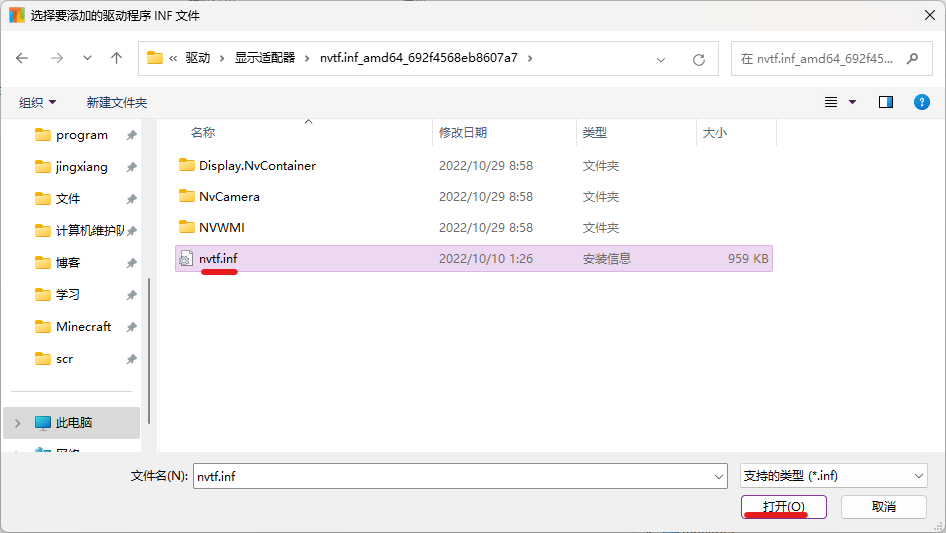

- 可以在队列中看到添加的驱动程序

***

**无人值守**——可以对安装系统时的一些设置进行操作（比如跳过网络设置）

- 双击更改项后面灰色的点，更改条件

***

**应用**——对镜像进行最后的修改并保存

- 如图设置

- 右侧列表为操作清单，确认无误后点击左上角“开始”

> 应用开始后不得中途退出，操作中断得到的镜像应删除，请勿使用！

**至此，预定制完毕**

***

## **二、通过VMware定制系统**

**在使用虚拟机时，光标无法移出虚拟机，可按Ctrl+Alt切换为系统光标**

在预定制母盘之后，就可对系统进行详细设置了，比如激活系统、安装驱动、安装软件

### 1.配置VHD虚拟磁盘

VHD虚拟磁盘在虚拟机中充当本地硬盘

- 右键Windows徽标，打开“磁盘管理”

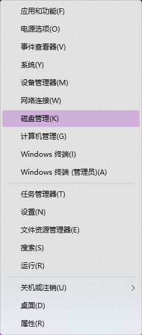

- 随意点击一个磁盘，在上方工具栏选择**操作——创建VHD**

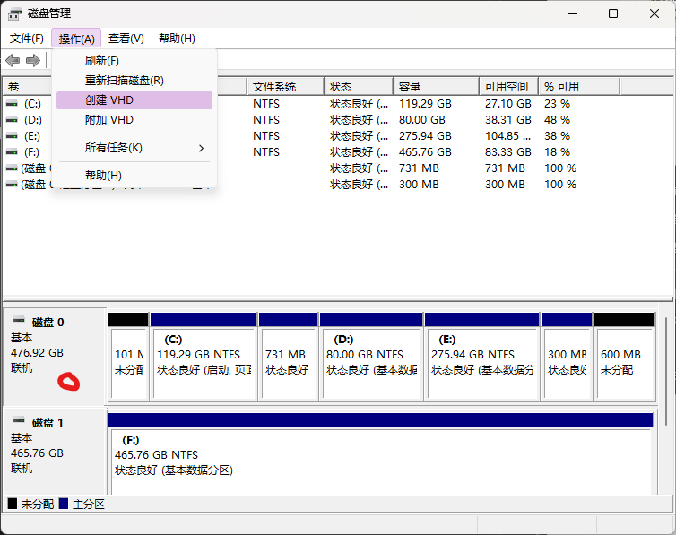

- 如图设置VHD，所在磁盘至少要有20G空闲空间，VHD大小为20G（要放母盘、软件以及一些工具与文件，封装得到的镜像也放在这里）

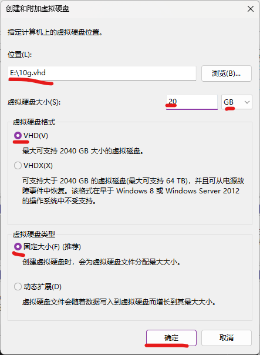

- 创建完成后，磁盘会显示未初始化，右键，点击初始化

- 磁盘分区形式选择**MBR**，点击确定

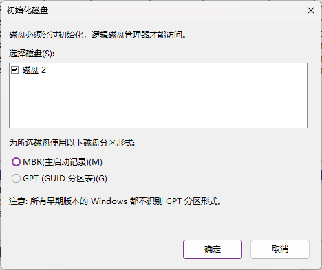

- 右键新建简单卷，一直点“下一页”

- 可在资源管理器中看到刚刚创建的VHD虚拟磁盘

- 将定制好的镜像、Easy Sysprep、CCleaner、Geek、激活工具以及想要安装的软件或文件放进去

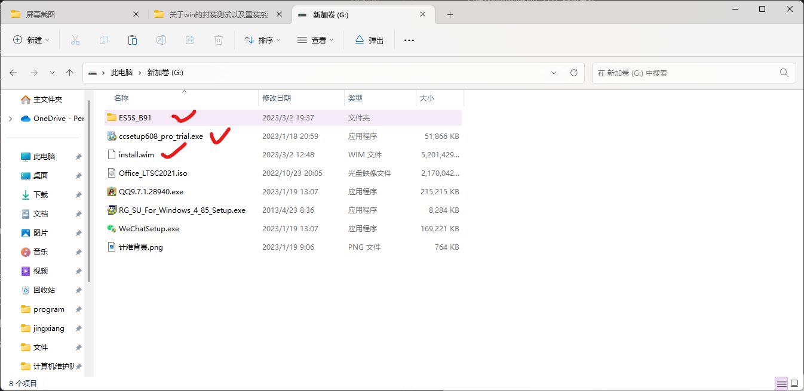

- 返回“磁盘管理”，右键分离VHD

***

### 2.配置虚拟机

- 新建虚拟机——自定义

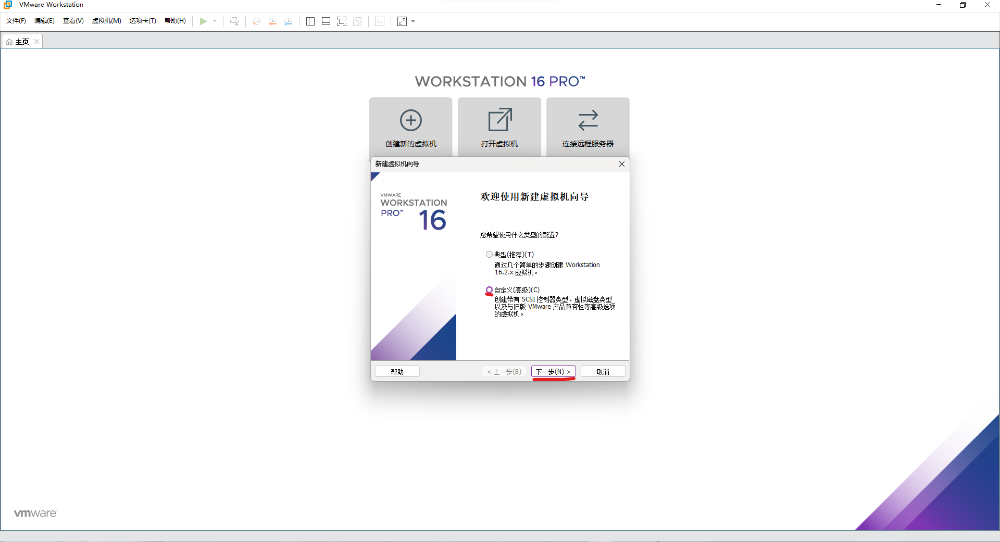

- 兼容性界面选择“下一步”

- 在安装操作系统界面选择生成的FirPE镜像文件

- 默认下一步，在命名界面选择纯英路径，**注意空间大小**（不建议放C盘）

- 固件类型选择BIOS

- 处理器内核不得超过宿主机

- 内存大小为宿主机的一半

- 网络类型默认，I/O控制器默认，磁盘类型默认

- 选择磁盘界面选择创建新的硬盘

- 如图配置，大小为50G，单文件储存

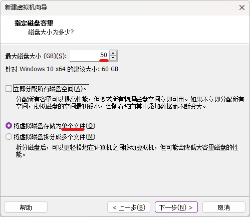

- 指定磁盘文件默认，下一页选择自定义硬件，移除声卡、打印机、USB控制器

- 虚拟机创建后点击左上角“编辑虚拟机设置”，添加硬盘

- 选择“使用现有磁盘”——浏览——文件类型选择“所有文件”
  
- 选择先前创建的VHD文件

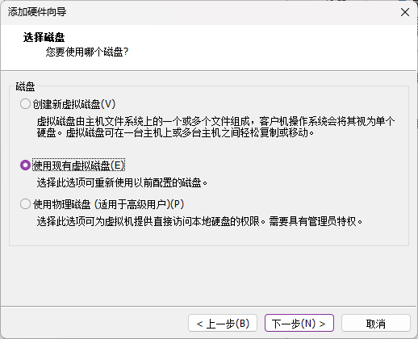

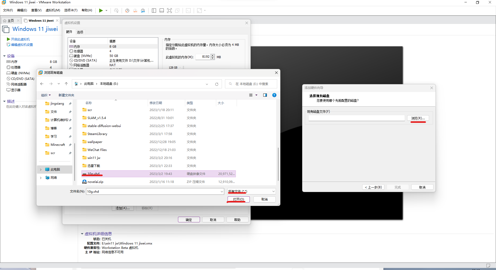

- 保持现有格式

***

### 3.安装系统

- 开启虚拟机，进入的是PE系统

- 使用DiskGenius给50G的磁盘新建分区

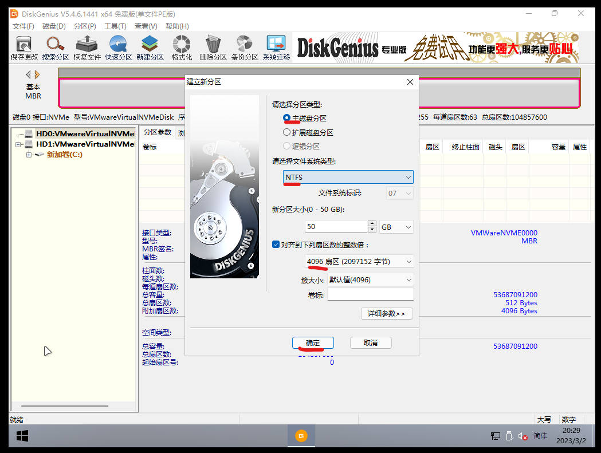

- WinNTSetup在开始菜单

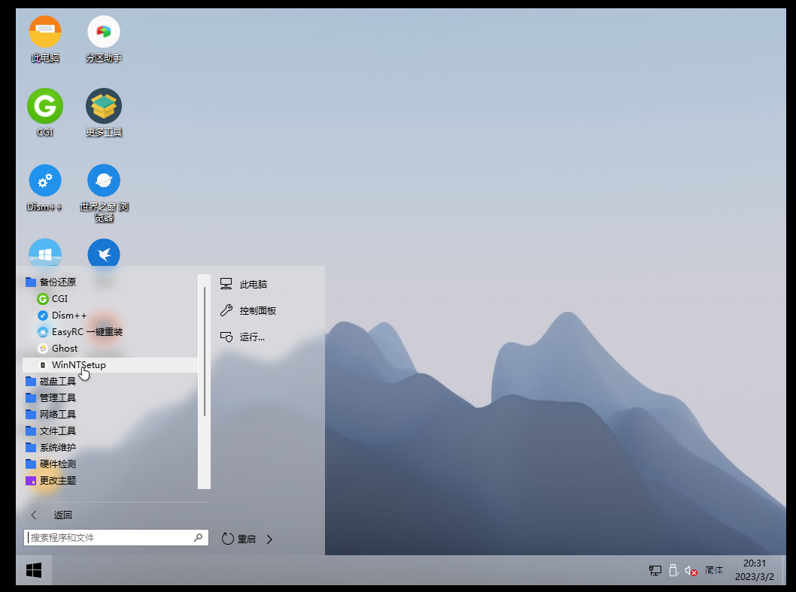

- 安装系统，由于是分区表类型为MBR，引导驱动器和安装驱动器位置应相同

- 安装完成后关机

> **如果出现这种情况，点击确认，并重新开启虚拟机**

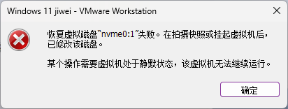

- 如果没有自动进入系统，请按图操作，不要开启虚拟机，而是先进入固件（BIOS）

- 确保“Hard Drive”在“CD-ROM Drive”之前

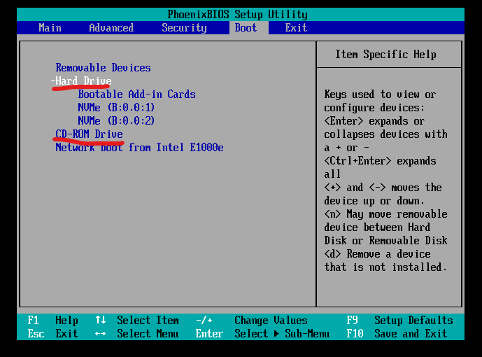

- 保存退出后进入系统

***

### 4.设置系统与安装软件

- 显示此界面时，**请按Ctrl+Shift+F3**，系统会重启，然后进入审查模式

 > **如果发现有文件遗漏，没有放进VHD里，可以关闭虚拟机，在资源管理器中双击VHD，放入文件后弹出**

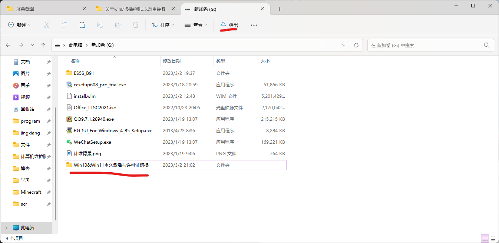

- 关闭此窗口

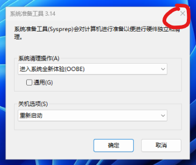

- 激活系统

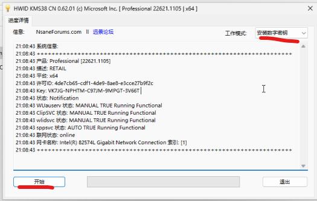

- 安装软件，如QQ、微信、锐捷、Office（**[如何安装Office](https://scau-jiwei.gitee.io/p/office-tool-plus-%E4%BD%BF%E7%94%A8%E6%95%99%E7%A8%8B/)**）

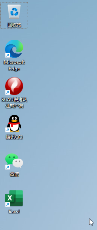

- 一些设置，如显示文件拓展名、显示桌面图标、更改桌面背景、更改浏览器主页样式

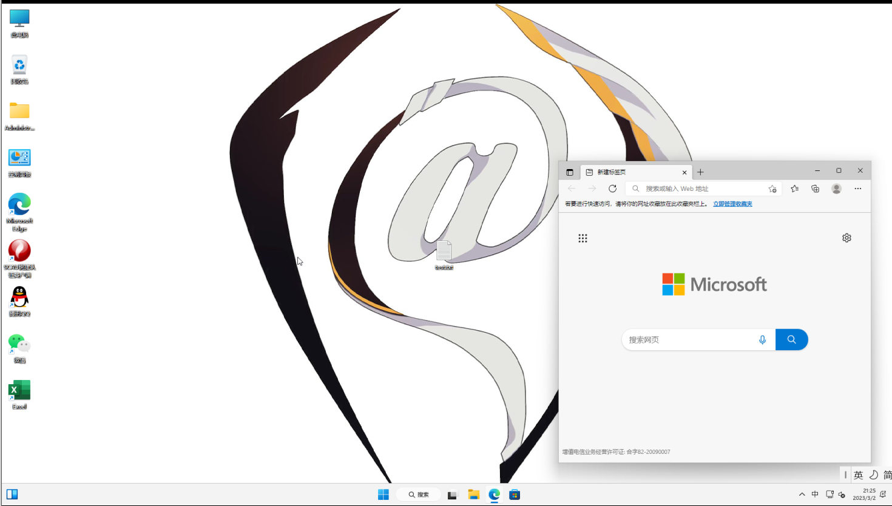

- 在所有操作完成后，彻底删除所有外来文件，并安装CCleaner

- 按1、2、3、1、2的顺序进行操作

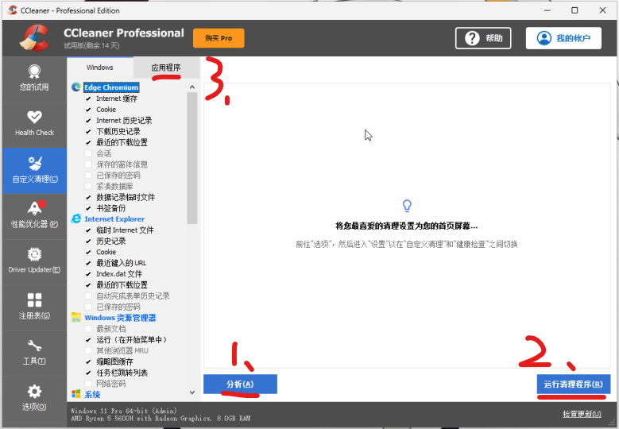

- 垃圾清理完成后，在Geek中右键卸载CCleaner

- 再彻底删除Geek

**至此，定制完毕**

***

## **三、封装系统**

### 1.系统内封装（先）

- 运行Easy Sysprep

- 点击设置

- 右侧全打勾，点击封装

- 选择完成后关机

>**封装系统时不要对系统进行任何操作！！！**

***

### 2.PE内封装（后）

- 在打开虚拟机时，进入固件（BIOS）

- 确保“CD-ROM Drive”在“Hard Drive”之前

- 保存退出后开启虚拟机，进入PE

- 运行Easy Sysprep，如图设置

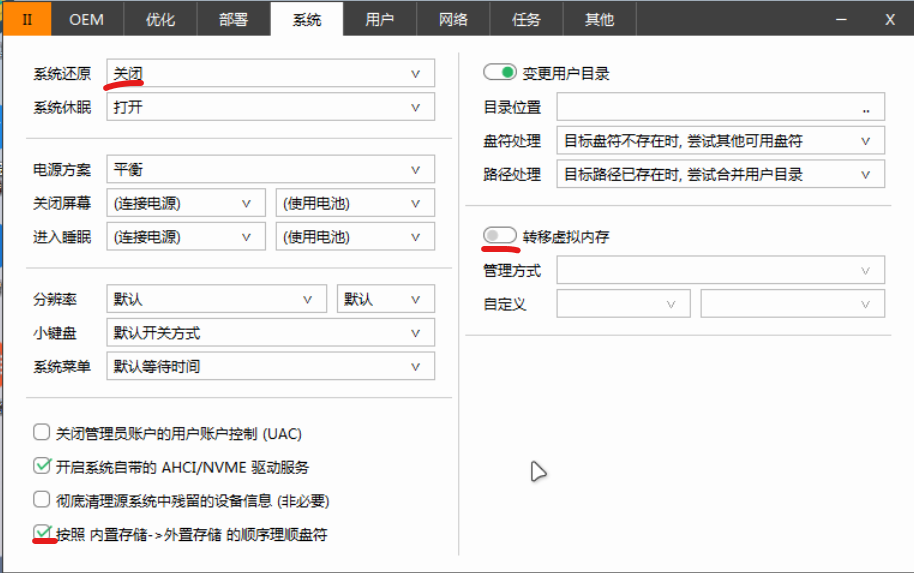

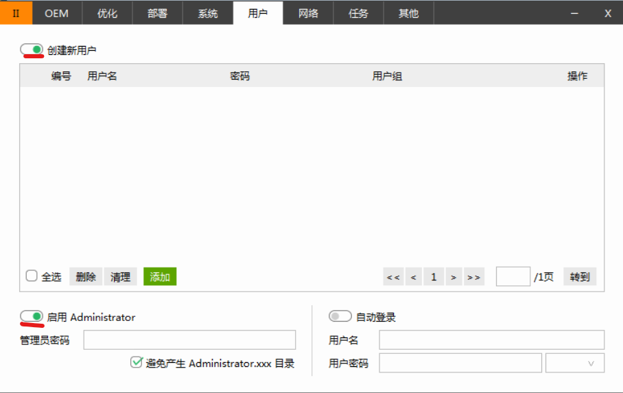

- 保存位置选择非系统盘

- 选择完成后退出

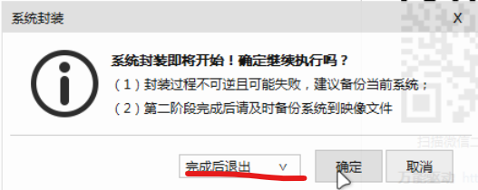

**至此，封装完毕**

***

## **四、测试**

使用WinNTSetup安装封装后的系统

- 格式化C盘，如图设置

- 安装版本可能会显示win10，不用理会

- 安装完成后**关机，不要重启，进入固件**

- 确保“Hard Drive”在“CD-ROM Drive”之前

- 退出BIOS后，进入系统

- 如果显示如图，则说明正在安装系统

>安装期间会重启多次，请留意虚拟机状态

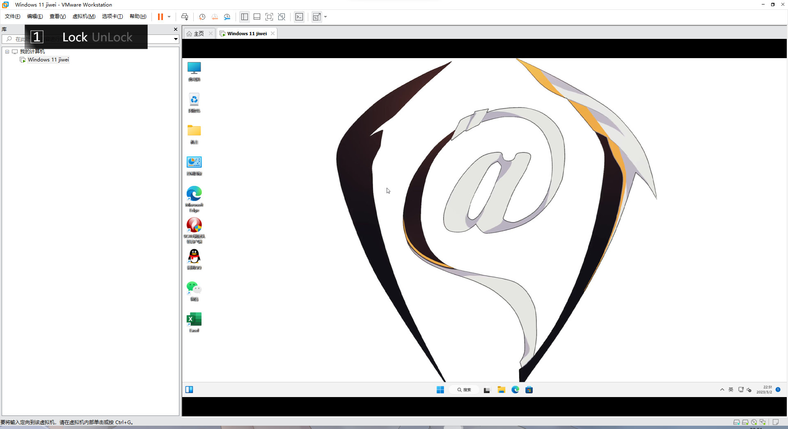

  **大功告成！！！**

>**P.S.这里让机主填**

### 此博客具有时效性，如有错误，请多多指正。 
