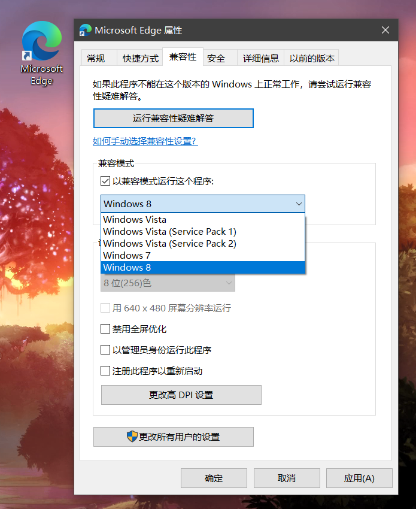
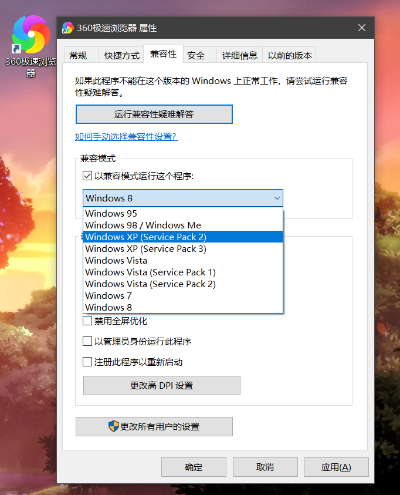
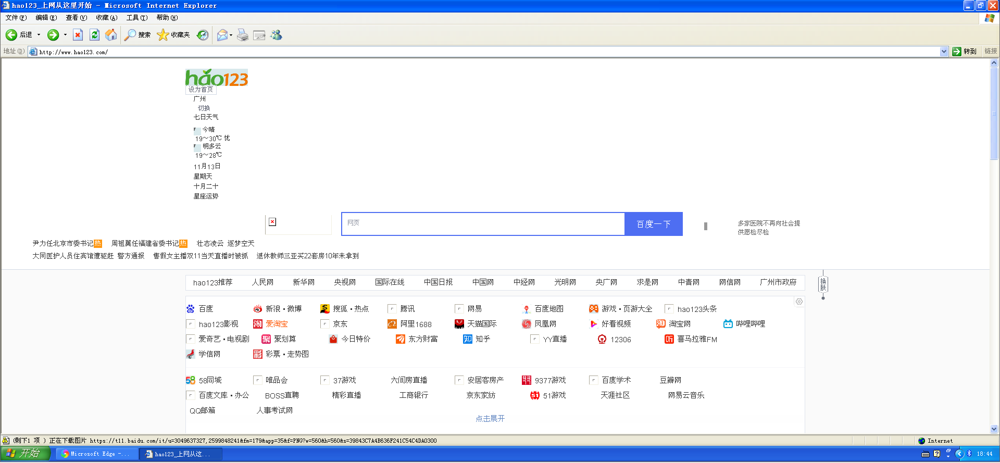
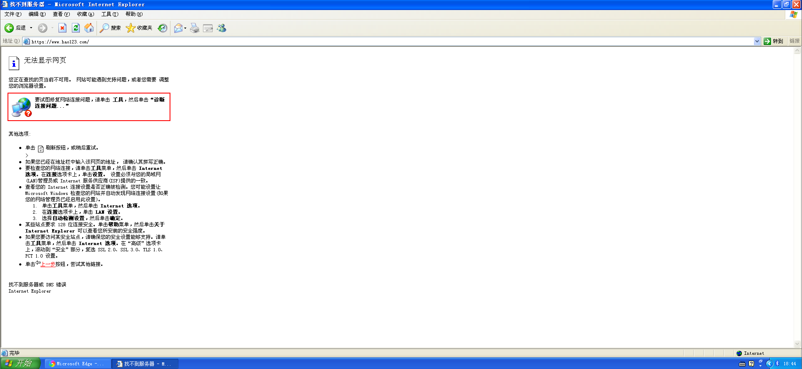
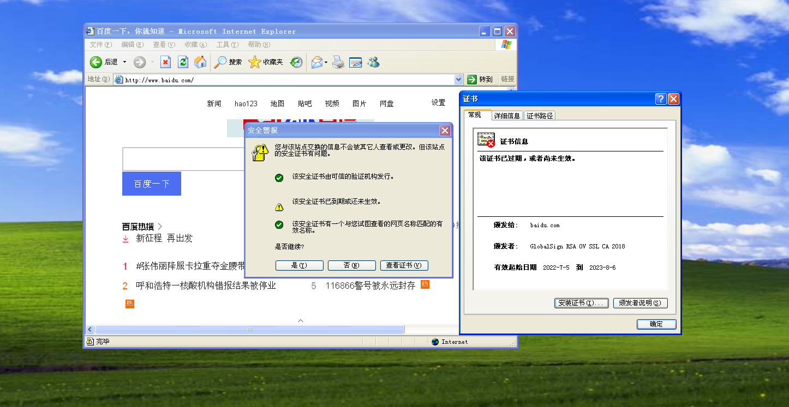

    关于网站访问安全证书等问题
    PS:此文章主要针对老系统(XP)的浏览器网络问题，一些退休老教师仍使用XP

# 各浏览器对各系统的兼容问题

1. Edge和Chrome和Firefox等兼容Windows 11/10/8.1/8/7，对xp都不兼容，在xp上无法安装。
2. XP系统能用的就是IE了，还有360浏览器，360浏览器之所以可以用是因为它双内核，其中一个是IE的内核，所以能和IE一样在XP上使用。
3. IE更轻量级，在XP上使用是比较顺畅的，但是现在XP的很多安全证书无法正常使用，也有很多网站不支持XP下的IE(甚至不对其开放，网站打不开)，大部分https的网站都打不开，只能开部分http的网站，换用360的话，情况稍微好转，部分https的网站也可以打开，但是可能会出现只能显示基本文字链接的情况，网页样式和动画都会无法显示，360浏览器也比较大，启动及访问在XP下的耗时都会比IE多得多。但是在XP下最好的解决方法也只有用360浏览器了。
(之所以讲XP这种老系统，是因为有些退休老教师还在用XP，我们可能会接到他们的任务)

# 浏览器的兼容模式
Win10环境下：Chrome和Edge的兼容性一样，不兼容xp，但因为只能向下兼容，所以没显示win11
 
360浏览器的兼容性(左边为win10环境下，右边为xp环境下)
可见360浏览器的兼容性是挺强的，可以兼容xp，98，95。
“我觉得360做得最好的就是兼容性了”，龙龙如是说。
兼容模式默认关闭，我这里打开是为了看看可以兼容什么系统，一般能安装都是能用的，不用打开兼容模式
如果开了兼容模式，浏览器的启动及网页访问耗时都会增加，比较兼容嘛，要兼顾更多东西自然速度就慢了
 
对于兼容性的原理问题与前端知识有关，不同系统中相同浏览器的html、css和js的标准不同(或者说渲染引擎有差别)，不同的浏览器也是如此，一个网页在不同浏览器上会出现一些区别，严重的在一些浏览器无法正常运作。
使用浏览器的时候，有的网页会提醒你打开兼容模式， 如用户名、密码无法输入等，打开兼容模式后，就可以让存在兼容性问题的网页正常使用，不过现在大部分网页兼容性以及浏览器兼容性对高版本系统都挺友好，也只有xp这种老系统比较可能出现这种问题。

# 安全证书问题

1. 网络安全证书错误会导致无法正常浏览网页，比较常见的是，电脑的时间设置错误或者电脑的时区设置和地区设置不是同一个地方，会出现网络安全证书错误。
如下为时间设置错误(win7及以下会提示安全证书错误，win8及以上不直接提示证书错误，但是看网址栏前面https变红意思就是安全证书错误，https是需要安全证书的，后面细说)

如下为时区和地区，得设置相同地方（win10环境，发现win10及以上这个设置不同也可以正常访问，windows旧版本还有这个问题）

2. XP系统的证书问题
前面浏览器的兼容性有说，XP下的IE大部分网页的安全证书都无法正常，无法访问https
大部分网站已不对IE兼容，XP下的IE更惨，以下即为XP下的IE，访问http才进去，网页面目全非

访问https直接网络错误无法访问，跳转链接的时候会提示证书问题。

百度的网页还兼容XP的IE，不过也会提示证书错误，即使证书是在有效期，只能进去http。

# http与https
HTTPS和HTTP的介绍
 超文本传输协议HTTP协议被用于在Web浏览器和网站服务器之间传递信息，HTTP协议以明文方式发送内容，不提供任何方式的数据加密，如果攻击者截取了Web浏览器和网站服务器之间的传输报文，就可以直接读懂其中的信息，因此，HTTP协议不适合传输一些敏感信息，比如：信用卡号、密码等支付信息。
    为了解决HTTP协议的这一缺陷，需要使用另一种协议：安全套接字层超文本传输协议HTTPS，为了数据传输的安全，HTTPS在HTTP的基础上加入了SSL/TLS协议，SSL/TLS依靠证书来验证服务器的身份，并为浏览器和服务器之间的通信加密。
    HTTPS协议是由SSL/TLS+HTTP协议构建的可进行加密传输、身份认证的网络协议，要比http协议安全

HTTPS和HTTP的主要区别
1、https协议需要到CA申请证书，一般免费证书较少，因而需要一定费用。
2、http是超文本传输协议，信息是明文传输，https则是具有安全性的ssl/tls加密传输协议。
3、http和https使用的是完全不同的连接方式，用的端口也不一样，前者是80，后者是443。
4、http的连接很简单，是无状态的；HTTPS协议是由SSL/TLS+HTTP协议构建的可进行加密传输、身份认证的网络协议，比http协议安全。
目前大部分网站都是采用了https，同时也保留了http访问
学校的OJ网站采用的就是http(大概是内网不用太担心安全才用这个)

我们小组之前接到一个住在嵩山的老爷爷的任务，如下

网络错误就是用IE无法访问很多网站，并且IE的首页已经关闭了，最后的解决方法就是下了个360极速浏览器，首页设置成百度，才可以用，但是访问很多网站也都面目全非，谷歌火狐都无法正常，一些软件还可以坚持使用(酷狗音乐)

XP会出现这些问题，主要是系统太老，网站太新，标准不断在变化，而XP早已停止更新，XP与如今各种网站已经形成了隔阂，现在很多网站在XP已经无法使用，再过一些时间，就快寿终正寝了。
