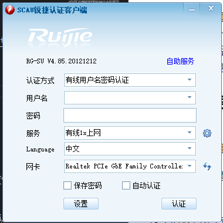
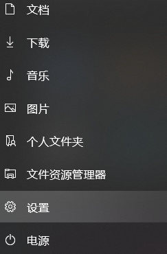
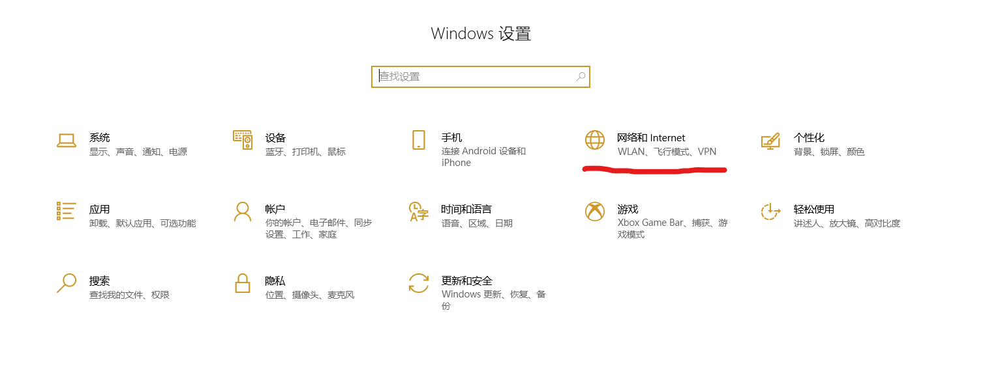
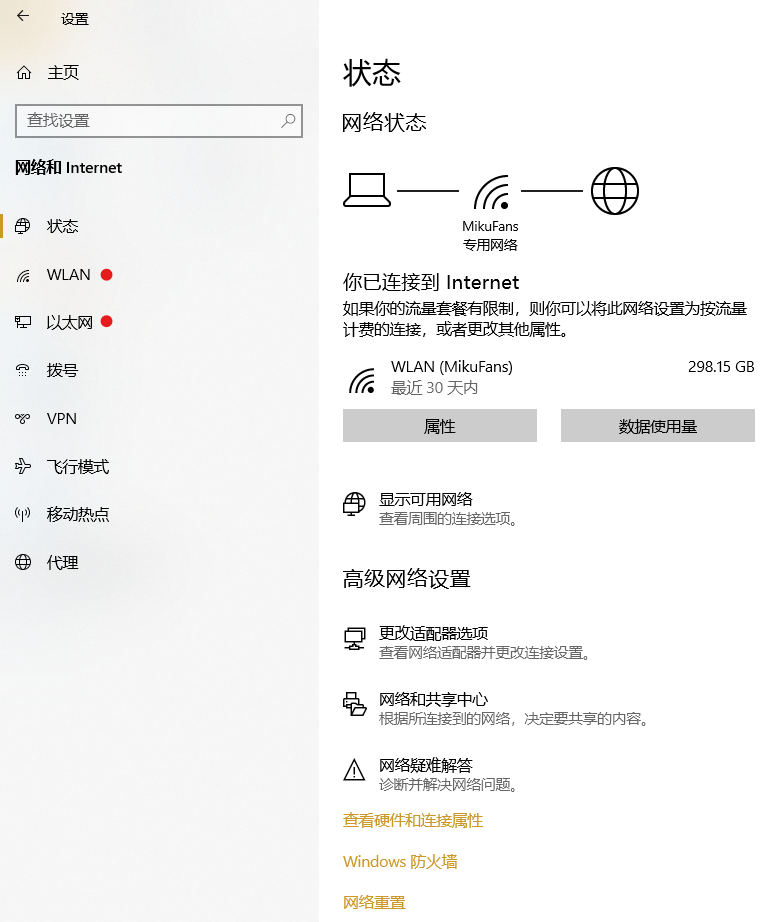
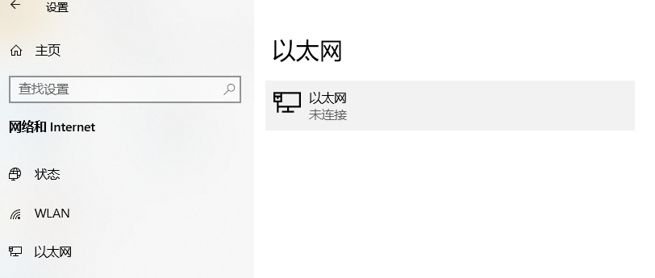
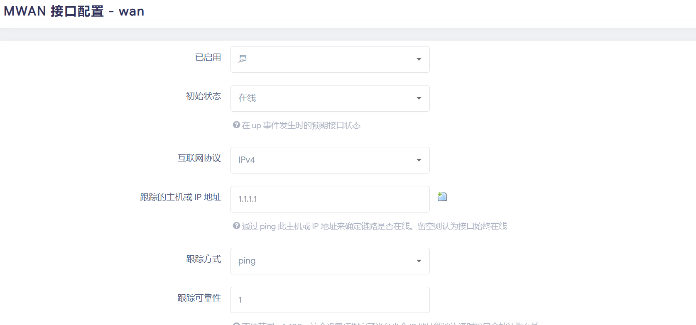
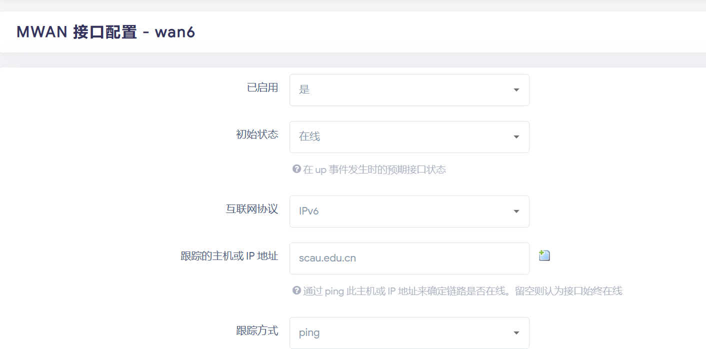
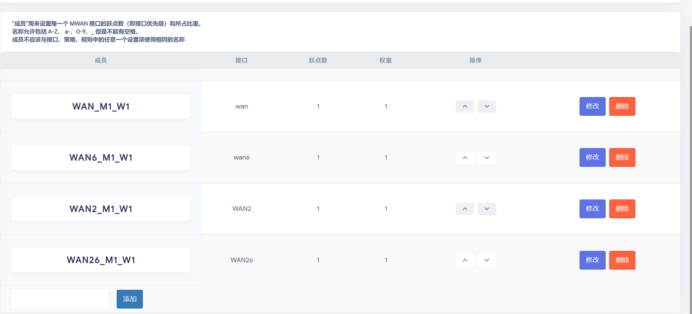
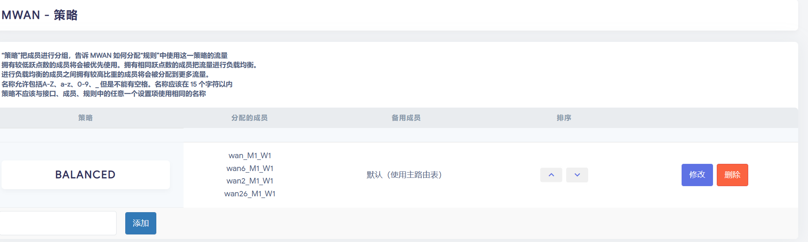

### 目录喵

一. 华农校园网的事实

二. 这篇指北要说什么

三. 宿舍网络体验优化

四. 高阶教程


---------------
# 一. 华农校园网的事实

华农校园网既有不可忽视的优点,也有让不少人难以忍受的缺点

##### 优点：宽带上下行百兆对等
- 有IPV6
- 有电信联通移动+cernet（虽然是前三家一起建的）四家出口
- ping极低（这个要考的，记住）
##### 缺点：校园网WiFi速度很慢，建议不用
- 无论有线和无线，在高峰期会有限速，人多就这样
- 只有两个位置（有线一个+无线一个或者无线两个） 

--------------
# 二. 这篇指北要说什么

作为大一新生，自己一开始也不会使用校园网，也是有骂过华农校园网垃圾的时候。但是在计维的帮助下，自己也开始了解校园网，开始正确使用校园网。我觉得，一百一年的价格，如此优质的网络，除了校园网之外再无别家。
    
在写这篇文章前，我一直保持着这个观点：
    
不是校园网不好用，是你不会用。

所以这篇文章我会用自己折腾的视角，讲述自己在折腾校园网的实践过程，讲述自己在宿舍和校外搞校园网的正确使用的方法。毕竟一个好的网络，是你大学幸福度的重要部分。
    
同时感谢计算机维修队在我折腾校园网的帮助，正是如此，我才写下这个文章，希望可以帮助更多的华农学子。

最后，
> 关注计算机维护队喵，关注计算机维护队谢谢喵！
> 
> ——计维邱烨
                           
-------

# 三. 宿舍网络体验优化

### (0) 前言：
上回说到，彼时的华农网络，开流量延迟460，校园网速度没一兆。计维渔夫召集众仙，要还华农网络一个朗朗乾坤。传说，渔夫在出征之时，曾言道......

### (1) 才刚刚开始：锐捷客户端的下载与使用
    
来到华农，你初来乍到，看到校园网一个月竟只要20块。想到你在网上看到校园网测速的视频，你狠下决心。用100+20开始了第一个月的校园网使用。

这里贴上学生办理入网的[官网教程](https://metc.scau.edu.cn/2018/1023/c129a128361/page.htm)

你只有一台手机，一台电脑。手机直接连上校园网“SCAUNET”，然后进入跳出的登录网址，输入学号和密码就好了。根据以往的经验，你准备了一根网线，将网线插上桌子下面的接口和电脑的接口，信心十足准备开始使用你的高速校园网。

但是发现你忘记了一个事情，华农的校园网需要锐捷认证！查看了学校官网，你发现要下个锐什么捷客户端（就是锐捷客户端）。

但是好像没有这个教程，你急了。

这时，你想起华农有一个笔记本推荐清单，那个里面有一个什么计维，叫计算机维护队来着的群号。你抱着进去水一下群的心情，加入了计维的QQ群。一看，哇，全是大佬！你抱着问完这个问题就退群的伸手党精神，在群上提出了这个问题。然后，计维渔夫出现了！他告诉了你如何配置好锐捷客户端。

##### 开始教程喵~

1. 进入官方网站下载锐捷客户端，[这是地址喵](https://metc.scau.edu.cn/131/list.htm)
    
2. 下载第一个“4_85”的版本

3. 安装完成后，进入这个界面



4. 进行这一段操作后，你点下“认证”按钮，终于连上了校园网！

    
### (2) 开始加速了：电脑看不了网址！

    用了一段时间，你发现华农的校园网，可能不是你想的那样子。
    
    原本你的最低预想就是速度慢了些，可这个校园网不中用啊！他竟然上不了网址！！！
    
    还好之前没有退群，你向计维渔夫告诉了这个问题，他告诉了这个是DNS服务器的问题并告诉你如何修复这个问题：
    
    这个时候肯定有人会问：“为什么是DNS服务器的问题？”

DNS服务器, 全称域名系统 (Domain Name System) ，它是由解析器和域名服务器组成的，又名域名解析服务器. 

DNS有什么作用？靠它把你要访问的网址找到然后把信息送到你电脑上。

简单来说，DNS服务器就是将你输入的网址（比如你输入`www.baidu.com`）转换为电脑看得懂的IP地址（`www.baidu.com`转换为对应的IP地址`14.215.177.39`）。

没有了DNS服务器，你输入的东西电脑也看不懂，自然也看不了网址。

##### 开始教程：
> 这里用win10演示，其他系统可以自行百度了解


**1. 点击开始菜单，打开设置**

   

**2. 点击网络设置**

   

**3. 选择你当前使用的网络，若是使用WiFi则选择`WLAN`、若是使用有线网，则选择`以太网`**

   

**4. 点击对应的网络**

   

   

**5. 进入以后, 点击编辑IP设置**

   

**6. 将设置模式改为手动, 并填入DNS服务器地址**

   

**7. 至此, DNS设置就大功告成啦**

- 以下为推荐设置的DNS服务器,因为考虑到学校出口是分流的，所以设置学校的dns应该会获得更好的分流效果：
首选: `202.116.160.33`  
备选: `202.116.160.32`
IPv6: `2001:da8:2004:1000:202:116:160:33`(不设置此dns会导致无法访问ipv6网站)

如果懒得设置也可以直接用学校自己的（也就是默认DHCP）

    于是, 在计维渔夫的帮助下，你终于可以在校园网下上百度，逛JD，逛淘宝，看B站了。

    “诶，计维，真不错啊。” 你发出了这样的感叹

### (3) 快点快点再快点：wifi好卡！还有其他设备想连接！

电脑搞定了，手机却出现了问题。校园网的wifi真的太慢了，1MB/S都没有!!!

而且自己带了个平板，每次都要上登录网址换设备。

你和渔夫发了这个牢骚，渔夫告诉你，“正确的！”
    
为什么呢？ 因为校园网的WiFi是2.4GHz/5Ghz双频的wifi，而且生活区有许多不同的终端连接WiFi，他们都会影响你的wifi体验，如果不是手机流量不足，这个wifi，不要也罢！（但是在你饭堂信号不好刷不了手机的时候，这个wifi有奇效！）

你问渔夫该怎么办，渔夫提出了一个你在电脑上没有用过的方法————用电脑开热点！！！
    
既然有线校园网比WiFi校园网好多了，就用电脑开个热点就好了啊！
    
用电脑开热点的方式这里就不多赘述，读者在百度查询即可。

### (4) 我们的目标是星辰大海：正经人谁用热点呀！我要搞路由器，让整个宿舍用我的校园网（省钱（雾））
    
大学才开始一个月，你发现你的电脑开热点是真的不好，电脑一直开机开热点是一个很笨的方案：电脑不一定一直都放在宿舍，而且电脑一天到晚开机也挺费电的，再再者，第二天早上还得给锐捷重新拨号才有网用，太麻烦了。

而且你感觉这个20块一个月的校园网有点贵啊！但是自己交了100块的开户费，不用又觉得可惜。

想来想去，你动了一个歪念头，不如自己搞一个路由器吧！然后说：“校园网ping极低，打王者巨爽！”，让全宿舍一起用这个校园网就好了！又省电又省钱，不亦乐哉！
    
但是你没有技术.....

于是，你决定：“召唤计维飞侠！”

轰轰轰——，计维渔夫出现了！你和渔夫说出了你的想法。
    
“我也不会......”渔夫挠了挠头。“但是你别急，我叫另外一个人过来。”

过了一会，计维longlong出现了，“longlong可是很厉害的！是计维技术组的杠把子！”渔夫说到。

然后longlong开始讲如何自己搭个路由器了：


##### 教程：

>   推荐参考：https://www.right.com.cn/forum/forum.php

这里需要有一定的知识储备，既然你都来到这一步了，不妨自己折腾折腾吧！
    
这里的路由器基于红米AC2100/小米AC2100制作，其他路由器方法大同小异，差异主要体现在刷breed的过程：
    
1. 刷入breed
   [*参考教程*](https://www.right.com.cn/forum/forum.php?mod=viewthread&tid=4066963&extra=page%3D1%26filter%3Dtypeid%26typeid%3D43)

2. 进入breed后, 在环境变量编辑里面加入一个名为`xiaomi.r3g.bootfw`的环境变量，值为`2`.
   
   这一步是刷入Openwrt的关键.

3. 在breed里面刷入Openwrt底包
   
4. 重启以后, 浏览器访问`192.168.1.1`, 登录root账号, 密码`password`, 进入管理页面
   
5. 进入`系统`-->`备份/升级`-->`刷写新的固件`
   
   选择`openwrt-ramips-mt7621-xiaomi_mi-router-ac2100-squashfs-sysupgrade.bin`

   完成以上操作后, 静候佳音即可......

6. 刷完机后, 以第4步同样的方式进去管理页面
   
   在`系统`-->`文件传输`中,传输`校园网&网络优化ipk`里的所有ipk
7. 依次安装
    - libpcap_1.8.1-1_mipsel_24kc
    - mentohust_0.3.1-2_mipsel_24kc
    - luci-app-mentohust_2.1-1_all
    - luci-i18n-mentohust-zh-cn_2.1-1_all
1. 重启路由器
2. 重启之后, 以第四步同样的方式进入管理页面, 服务里面会有锐捷认证这个选项
3.  设置锐捷认证的参数,
    
    **帐号**: 你的学号@有线1x上网

    **密码**: 你的校园网密码/统一认证平台的密码

    **网卡**: `wan口的接口，在网络--接口页面可以查看`

    **允许失败次数**: 0

    **组播地址**: 锐捷

    **DHCP方式**: 认证前

    **是否后台**: 1

    **DHCP脚本**: 此项留空

4.  完成以上设置以后勾选最上面的启用（不要勾选开机启动）, 再点击两次保存并应用就可以上网啦
5.   如果需要开机自启可以在管理页面中的`系统`-->`启动项`-->`本地启动脚本`中, 在`exit0`前面加入`mentohust`
        
> PS.
> 
> 如果需要使用MIUI+一类的多屏协同，推荐将5G信道设置为149以上，否则多屏协同会出现卡顿。
> 
> 
-------
    
# 四. 高阶教程
  
参考教程：

https://blog.csdn.net/lvshaorong/article/details/61916525
   
https://www.right.com.cn/forum/thread-76672-1-1.html


### 你的速度可能还是不够！
因为校园网物理限制了100Mpbs, 导致最高只能11.80MB/S！而且因为路由器的IPv6配置相对复杂，导致不经配置地使用路由器时无法正常使用IPv6！

但是!

方法总比困难多！

墙上有三个网口！！！

OpenWRT支持NAT6！！

我们！！

可以！

做一个NAT6！！

并利用多个网口！！

提升网速！！

### NAT6教程

参考文章:https://www.jianshu.com/p/eb07eaac6167

>本教程以没有“NAT6助手”的OpenWRT举例,如果已经有了"NAT6助手",在里面直接启用即可一键配置好NAT6.
>
>本教程使用的路由器依旧是小米/红米AC2100
>
>需要的基础知识:
>
> 1. 路由器刷机(见上文)
> 2. ssh连接路由器的基础知识

1. 首先,先确保你的固件支持IPv6,本教程内提供的固件确定是支持IPv6的.

2. 进入网络---接口,将WAN的DNS设置为如图所示:(都是修改为2001:da8:2004:1000:202:116:160:33)


将WAN6的DNS设置为图下所示:


将LAN的DNS设置为图下所示:


修改完成后路由器才可正常地解析IPv6,因为未知原因,202.116.160.33无法正常地解析IPv6地址.

然后在LAN的DHCP服务器---IPv6设置里面修改为如图所示:


3. ssh连接路由器,然后输入下面三行命令:

>uci set network.wan6.sourcefilter=0

>uci commit network

>ifup wan6

注:如果在下面的多拨里面也需要IPv6叠加,则需要对新加入的IPv6接口执行类似的代码(将wan6换成你新建的IPv6接口的名字即可)

4. 在网络---防火墙---自定义规则内加入以下规则:

ip6tables -t nat -A POSTROUTING -o eth0.2 -j MASQUERADE

其中的eth0.2要修改成你自己的网卡名,否则会出问题.

做到这一步之后尝试在终端上执行ping6 scau.edu.cn,在电脑(Windows)上执行ping -6 scau.edu.cn

若均可以ping通,则大功告成,如果不行,尝试插拔网线/重启路由器,实在不行找longlong!


### 多拨教程
> 本教程以双线双拨举例, 需要两个人的校园网账号
> 
> 本教程使用的路由器仍然是小米/红米AC2100
> 
> 需要的基础知识:
> 1. 路由器刷机(见上文的教程)
> 2. Linux Shell命令的使用
> 3. vim的使用
> 4. ssh的使用
> 5. WinSCP的使用(非必须)
1. 首先，最好选择一个自带`mwan3`的固件，否则自己安装`mwan3`十分的麻烦而且容易出问题。  
   
   这里[推荐一个固件](https://openwrt.mpdn.fun:8443/?dir=lede/mtk/)（适配小米/红米AC2100）

2. 固件安装上去之后先按照上文的教程安装上mentohust并且认证校园网
   
3. 进入管理页面
   
4. 进入`网络`-->`交换机`, 修改`Lan1`参数如下并保存：
   
    

5. 在`网络`-->`接口`里面添加一个新接口
   
    **名称**: 随意，本处使用的是wan2，若需要添加ipv6，则可以再添加一个名称为wan26的接口

    **包括接口**: 选择新增的`eth0.3`（或者叫另外一个名字）

    **协议**: `dhcp（如果需要ipv6的话则再加一个接口，协议选择dhcpv6）`

6. 在接口修改里面将其加到WAN的防火墙域, 并且给四个接口设置不一样的跃点
   
   修改跃点可使用uci，教程如下:
   
   连接ssh后输入以下命令:

   >uci set network.接口名称.metric='自己想一个数字'

   注意：四个接口的跃点数不能相同


7. 使用ssh连接路由器，执行以下命令（需要root权限）
    ```bash
    cp /usr/sbin/mentohust /usr/sbin/mentohust1
    cp /etc/mentohust.conf /etc/mentohus1.conf
    ```

8. 执行以下命令: 
   ```
   vi /usr/sbin/mentohust1
   ```

   此时进入了vim文件查看模式, 按`i`键进入编辑模式, 将里面所有的*mentohust*替换成*mentohus1*
   后, 接着按下`Esc`退出编辑模式, 随后输入`:wq`并按下回车保存
   
   随后输入chmod 777 /usr/sbin/mentohust1给予其运行权限

9.  执行以下命令
    
    ```
    vi /etc/mentohus1.conf
    ```

    在vim下将认证账号密码还有网卡名修改成对应的新的网口信息以后便可保存退出

10. 执行`mentohust1`即可完成第二个账号的认证。
    
11. 进入`网络`-->`负载均衡`进行如下设置:
    
    >新增接口如下（IPv4与IPv6的配置略有不同）

    

    

    **成员**如下图:

    

    **策略**如下:

    
    
    **规则**如下（可以删除HTTPS规则，在校园网环境下并不会有什么影响）：

    

12. 上文的开机脚本修改为下文:

>mentohust

>sleep 5

>mentohust1

13. 耶, 理论上到这里就大功告成啦

结语：
-----
终于，你在宿舍拥有自己的路由器，在华农的校园网中杀出一条血路，拥有了自己的一片天地。宿友都因为有了你的路由器，王者直接保持ping=17，干翻了华农所有人。周围的人仰慕你的能力，纷纷向你询问方法，你却说：“关注计算机维护队喵，关注计算机维护队谢谢喵！”

无奖问答：渔夫曾言道什么？


    


