# 椰香后援会
##### ——应援计划通
## 一、硬件维修相关（需拆机）

### （零）开始任务之前

要谨记，在开始任何修机任务之前，都必须确保机主已报修并签署协议。

要注意，签署协议还要提醒机主抄写方框上的那一句话。

### （一）拆机步骤

#### 1.获取计算机中加密卷信息

#### （1）“win+r”唤出运行命令框

#### （2）输入“manage-bde -status”查询被bitlocker加密的卷

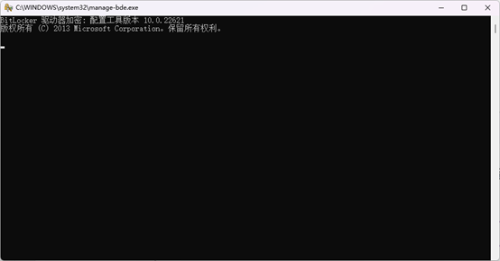

 若无Bitlocker信息（和图中一样），则跳转至步骤2：查询该型号笔记本的硬件信息

#### （3）获取密钥，防止数据被锁

以管理员权限运行“获取恢复密钥.bat”，等待脚本运行完毕

程序会在C盘生成一个叫做OutPutKey的文件夹

将此文件夹复制到一个U盘之后就可以放心地开始做任务了。

#### 2.查询该型号笔记本的硬件信息

通过网络搜索，查询该机型的相关硬件信息，如：**螺丝位置、螺丝数量、螺丝长度、是否具有防滑螺丝、后盖拆卸与装配的要点、主板上各零部件位置**等

#### 3.拆除D面背板

>**在关机情况下进行，正式拆机前应洗手（除静电）**

#### （1）移除供电线、网线、外设，防尘塞同理

#### （2）卸下螺丝

将笔记本翻至D面（后盖）

使用对应的螺丝批（十字/一字/梅花）拧出螺丝，将螺丝按照在后盖上的位置进行摆放

#### （3）撬开后盖

使用撬棒、翘片等工具，抵住后盖与机体的缝，将后盖从边角撬开

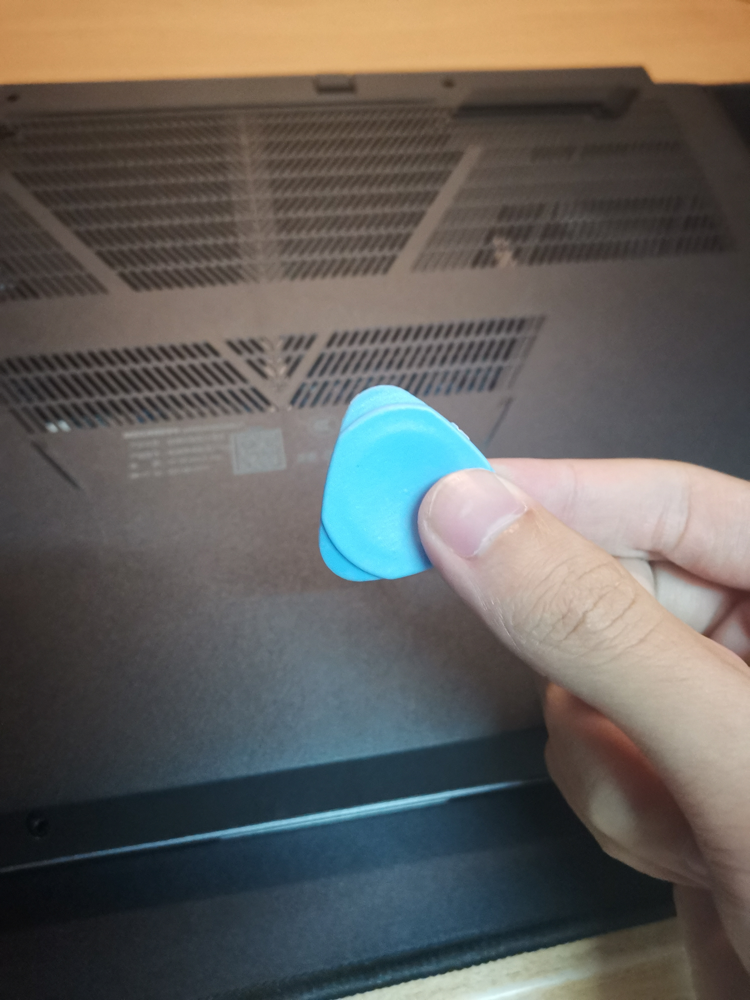

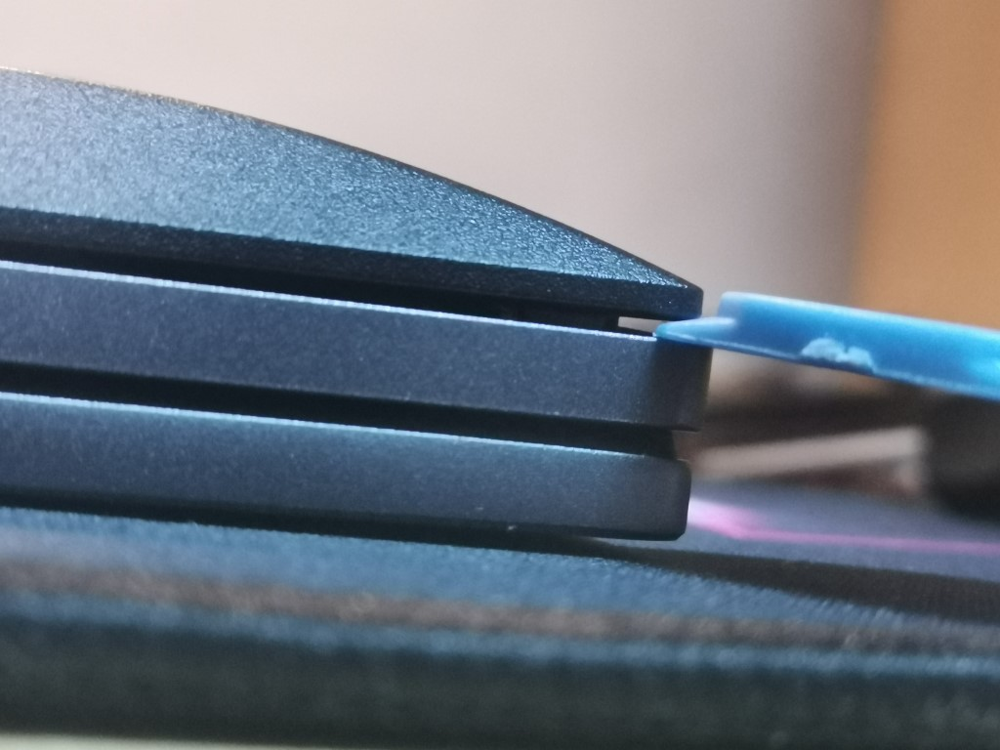

>翘片卡进去后，可以听到后盖卡扣脱离机体的声音

将翘片沿边缘缓慢划过，使用巧劲，确保所有的卡扣脱离

有的机型后盖比较复杂，这就需要预先灵活使用网络搜索

### （二）认识笔记本主板上的元件

#### 1.俯视图

#### 2.解析图

>1.散热模块  
2.CPU、GPU核心  
3.M.2固态硬盘位（2）  
4.内存条（2）  
5.网卡  
6.电池  

  
不同的笔记本，主板构造大同小异

### **以下进行具体案例示范，所有操作均在电源排线移除的情况下完成**

 电源排线位置

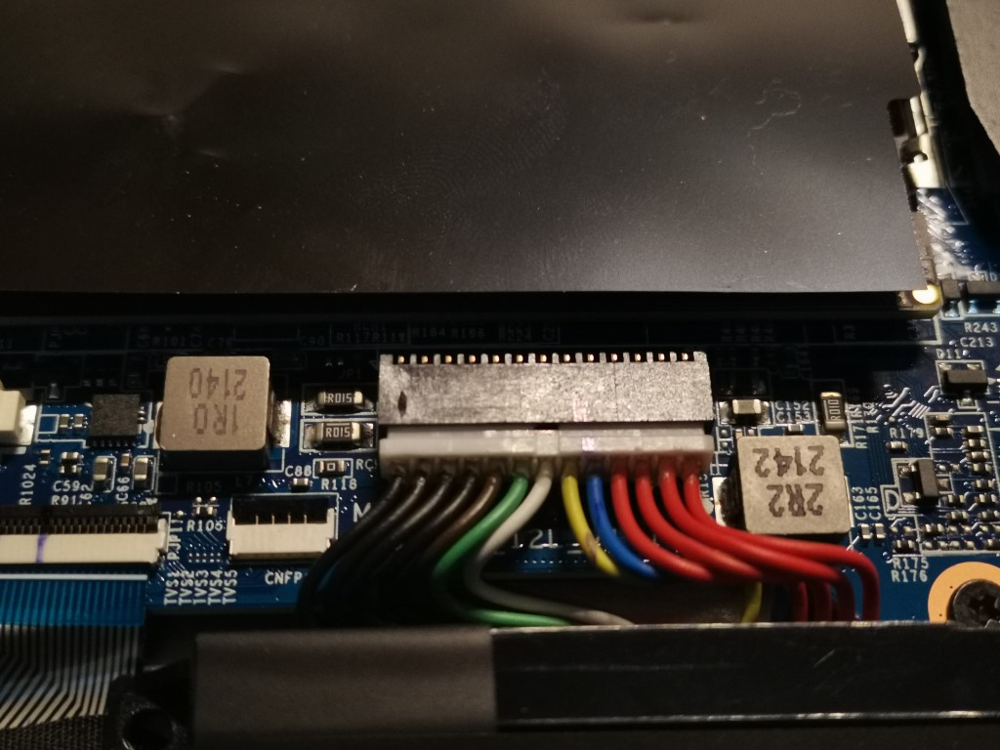

拆除电源排线

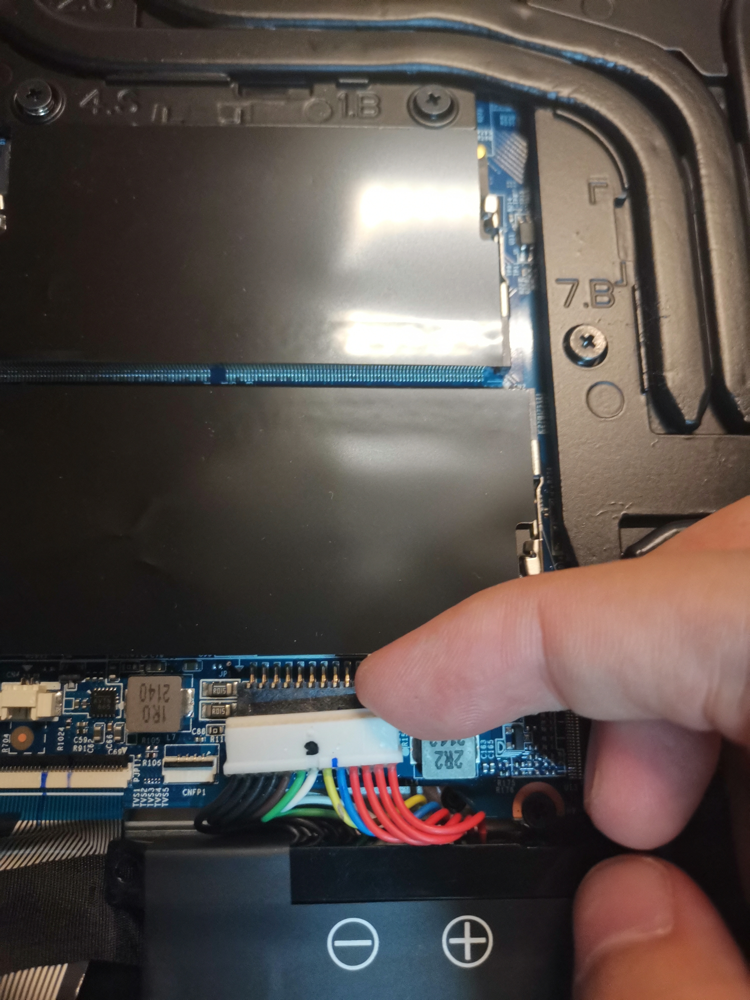

>**释放静电:长按电源键30秒、洗手**

### （三）加装（更换）M.2固态硬盘

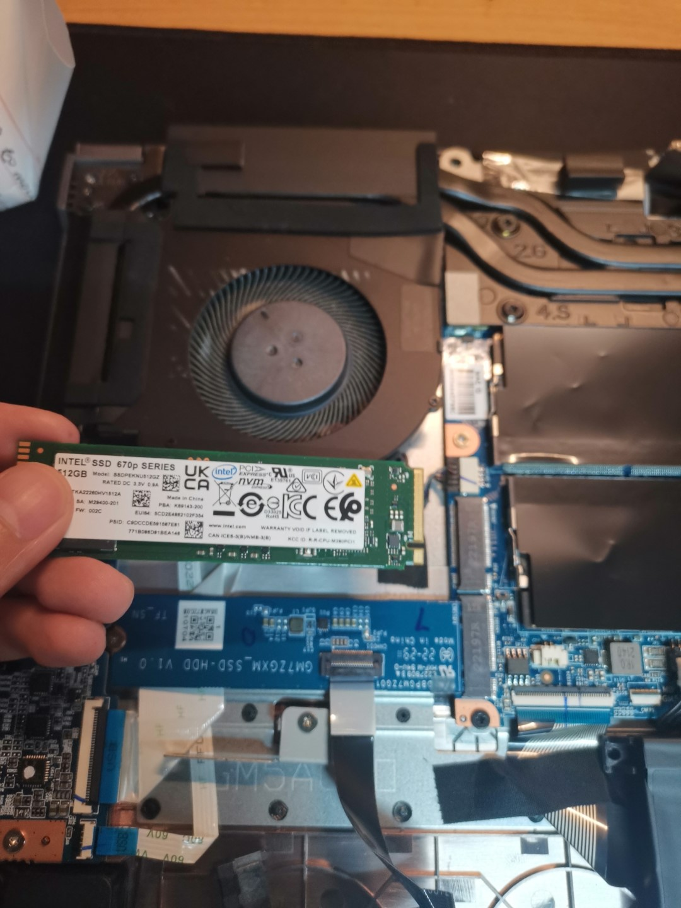

#### 1.取下原有的固定螺丝

>有散热马甲的应先取下

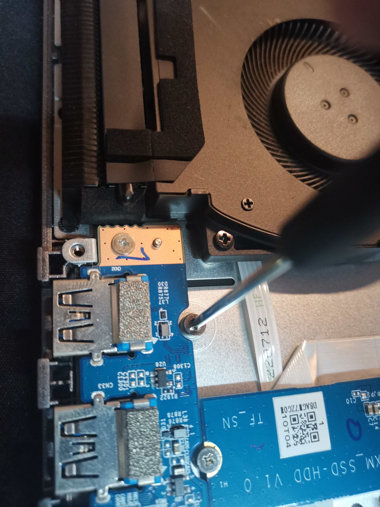

#### 2.拿M.2固态硬盘虚触接口

观察防呆设计

>不要大力出奇迹！！！

#### 3.放入固态硬盘

先斜着放入，再用磁吸批头吸着螺丝将其压下，并固定

### （四）清灰

>**记得戴口罩**

#### 1.扫去表面灰尘

用软毛刷刷去风扇附近的灰尘

后盖上可能也会有附着的灰尘，记得清理

#### 2.深入清理风扇中的灰尘

将毛刷插入风扇，使刷子与扇叶充分接触，再用刷子将灰尘挑出

>这一步清理出来的灰尘较多，注意收集措施

用毛刷清理完之后，再用气吹吹出灰尘  

使用气吹时，动作要迅速，利用产生的气流将扇叶、散热鳍片上残留的灰尘吹走

吹至无扬尘出现后，可换至另一边的风扇清理

最后，用气吹清理掉落在主板表面的灰尘

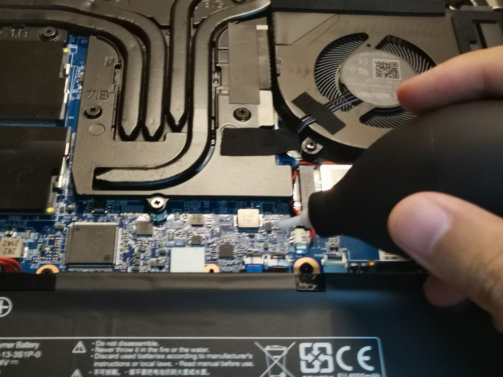

>**目的：防止灰尘掉落在主板上造成元器件损伤**

### （五）加装（更换）内存条

内存条所在位置如图，一般有黑色绝缘片

#### 1.拿内存条虚触接口

观察防呆设计

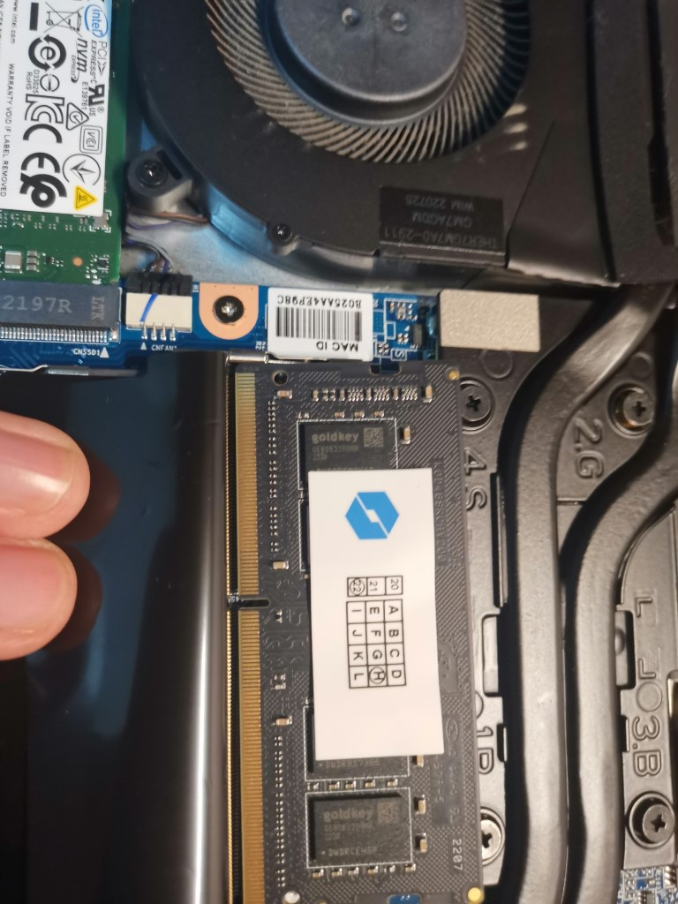

#### 2.放入内存条

斜放内存条

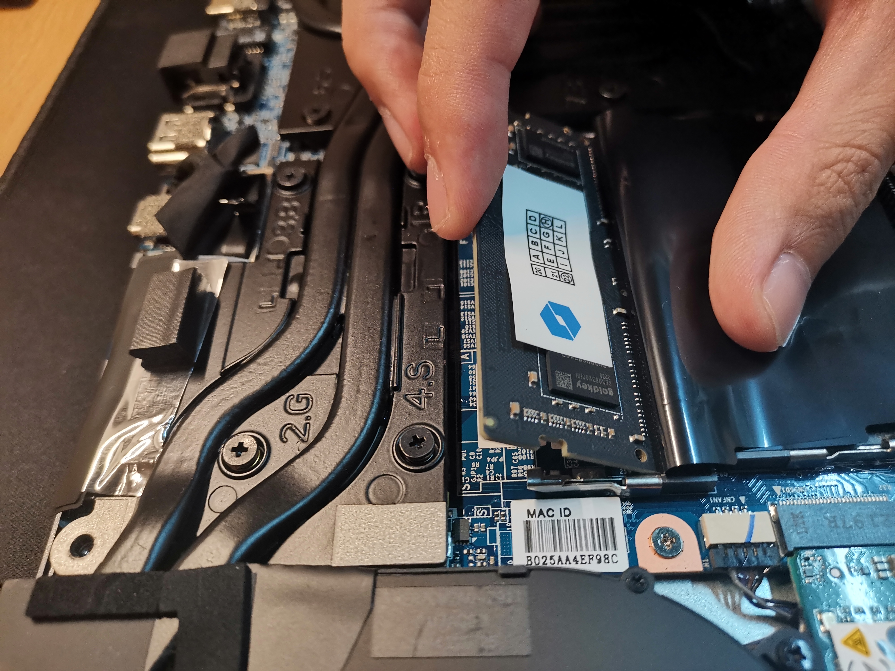

固定内存条的是两根弹性金属条，配有卡扣  

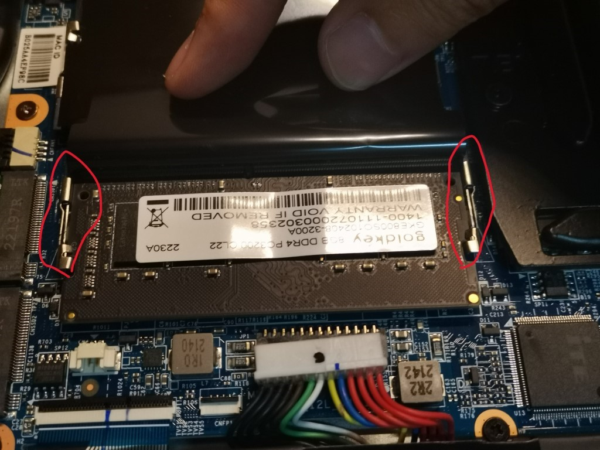

在放入内存条时，可稍微用力压下，直至金属条卡扣扣上

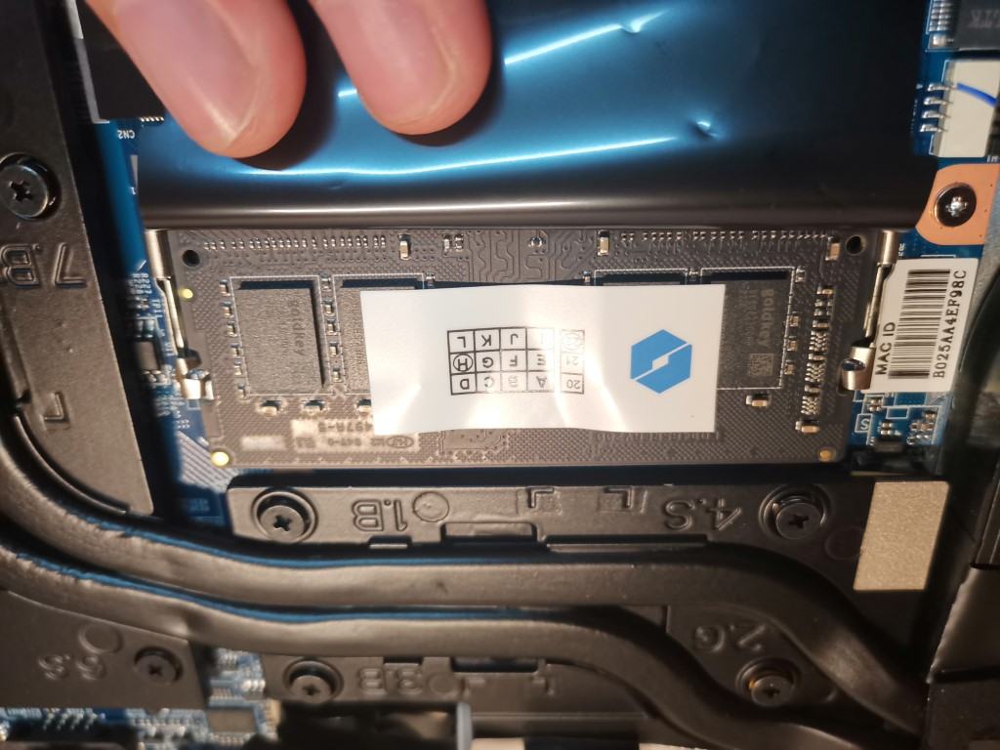

### **在进行完上述操作后，将电源排线插回**

#### 1.试装

因为有的机型需要后盖才能正常开机，所以检测应当在装上后盖的情况下进行
 

听到卡扣合上的声音才算装好
 
#### 2.检测

试装后盖后，开机，进入设备管理器（右键此电脑\显示更多选项\管理\单击设备管理器）  

再进入任务管理器（ctrl+shift+esc\性能），观察各项指标有无变动

>CPU频率、显存大小、硬盘个数、磁盘大小、网络适配器、内存大小，以及是否能识别外设

CPU、GPU指标如图

硬盘指标如图

网络适配器指标如图

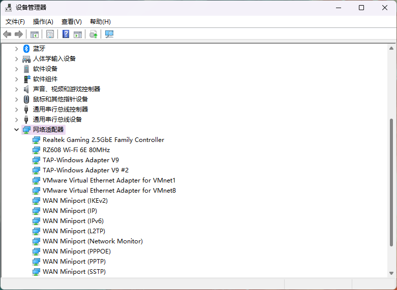

若无异常，则关机并装上后盖螺丝

>**自此，装机完成**

